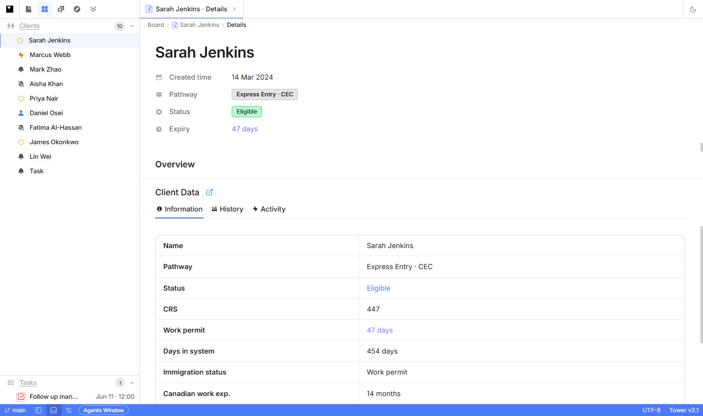
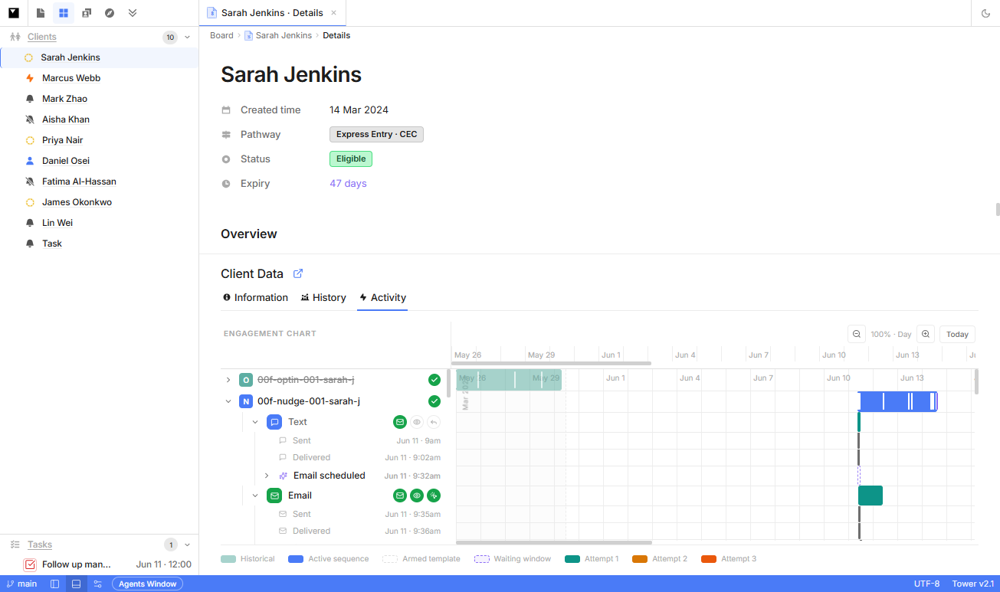
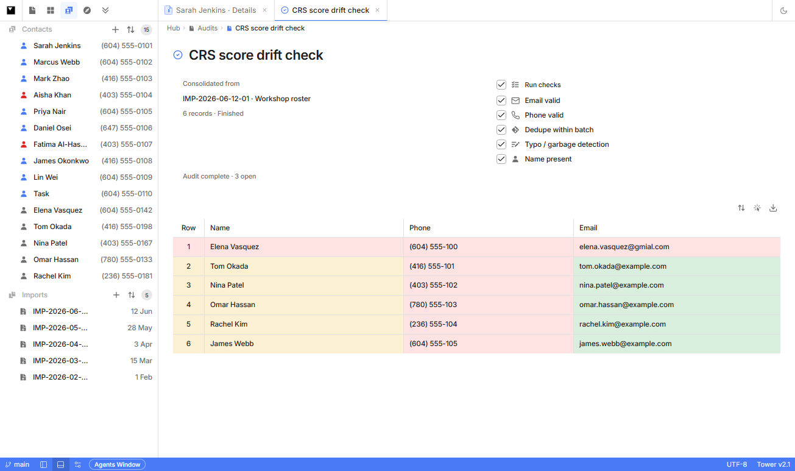
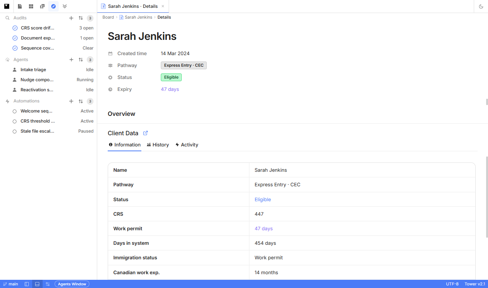
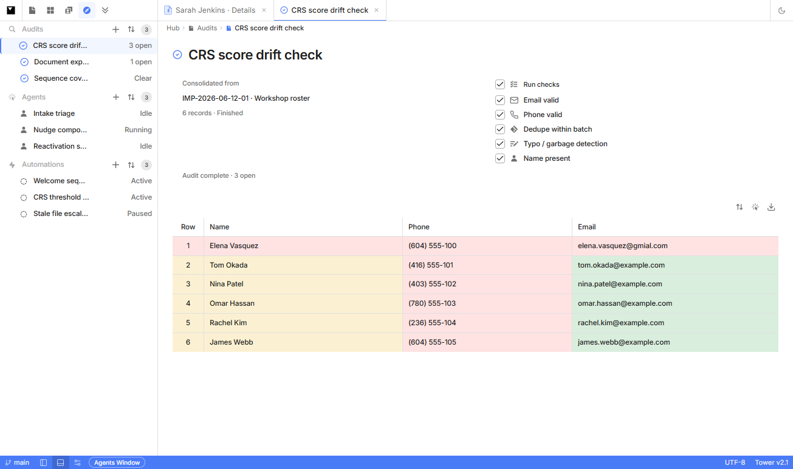
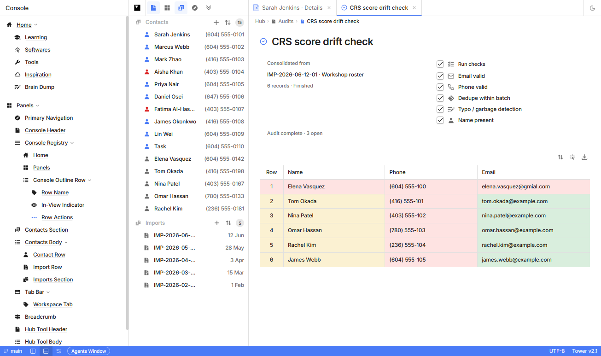

# Tower — Product State v0.1.0

> Tower is a **client-side immigration engagement prototype**: a VS Code–like consultant shell with mock data, rich Sarah/Marcus journey UI, a live Console holon registry, and the first **end-to-end Hub Audit** flow (import selection → simulated gate run → reachability table).

---

## 0. Document control

| Field | Value |
|-------|-------|
| **PSD ID** | `PSD-tower-v0.1.0` |
| **Scope** | Whole product (`tower`) |
| **Supersedes** | none — **initial baseline** |
| **As of** | 2026-06-19 |
| **Build** | `npm run build` passing |
| **Guide** | [`PRODUCT-STATE-GUIDE.md`](../PRODUCT-STATE-GUIDE.md) |

---

## 1. Executive snapshot

**Product:** Tower — proactive eligibility + engagement platform for immigration firms (prototype).  
**Primary user:** Immigration consultant / firm operator working contacts through sequences.  
**Core loop (today):** Partially demonstrated in UI — **Contacts → Audit (reachability) → Sequence (Sarah/Marcus mock) → Client Data → Engagement chart**. No live rule engine or backend.

### 1.1 Maturity at a glance

| Surface | Maturity | One line |
|---------|----------|----------|
| Shell (nav, tabs, panels) | **High** | Four-column layout, resizable Console/detail, theme toggle |
| Board (clients + tasks) | **High** | 10 clients, phase tooltips, task → activity focus |
| Client details + Activity | **High** (Sarah/Marcus) | Brief + Client Data + Journey/engagement chart |
| Contacts directory | **Medium** | List wired; contact tab body stub |
| Hub → Audits | **High** (mock) | Create, run gates, open complete audit, reachability table |
| Hub → Agents / Automations | **Low** | Directory rows only; detail stub |
| Console / holon register | **High** registry | Hover highlight + reveal; detail articles mostly stub |
| CSV import UX | **Medium** | Full dialog; **does not** mutate import list |
| Backend / persistence | **None** | All seed + in-memory session state |

### 1.2 Top 3 truths right now

1. **Everything runs in the browser** — seed files + React context; refresh loses session-created audits unless re-seeded logic is re-run.
2. **Sarah Jenkins is the reference client** — portal, full journey (opt-in + nudges + reactivation), CRS history, engagement inspector payloads.
3. **Hub Audits are the newest complete vertical** — only Hub section with create → progress → inspect records flow.

### 1.3 Top 3 limits right now

1. **No API, auth, or firm account model** — single-user prototype.
2. **Rule engine is static** — eligibility signals and journey trees are data files, not runtime evaluation.
3. **Most Hub tools and holon detail articles are placeholders** — Agents, Automations, Account, Settings.

---

## 2. Product position

Tower’s vision ([`tower-product-vision.md`](../../ideas/tower-product-vision.md)) is: **contacts → audit → sequence → data collection → rules → nudges**, continuously.

**This PSD claims shipped in prototype:**

- Spatial shell and consultant workflow chrome
- Reachability **audit** as operational gate (not sales assessment)
- Standard **engagement sequences** as unified Gantt + tree (Sarah, partial Marcus)
- **Console** as live holon map of the shell

**This PSD explicitly does not claim:**

- Live rule engine firing nudges on data changes
- Provider enrichment (deliverability, line type, etc.) — see [`audit-module.md`](../../ideas/audit-module.md) tiers
- Firm/reseller/white-label account structure
- Production import pipeline or CRM sync

---

## 3. Shell & navigation

### 3.1 Layout

```
┌──────────┬─────────────┬──────────────────────────┬──────────────┐
│ Activity │ Board       │ Workspace (tabs)         │ Holon Detail │
│ bar      │ sidebar     │                          │ (optional)   │
├──────────┼─────────────┼──────────────────────────┤              │
│ Console  │ (same col   │ Client / Contact / Hub   │ View Details │
│ (toggle) │  as board)  │ tool views               │ from Console │
└──────────┴─────────────┴──────────────────────────┴──────────────┘
│ Status bar (decorative)                                              │
└──────────────────────────────────────────────────────────────────────┘
```

- **Console column:** toggled from document icon; `DocsPanel` + optional `HolonDetailPanel`
- **Board sidebar:** client list or contacts/hub body depending on nav mode
- **Workspace:** tabbed; one active tab renders full content
- **Client Data panel:** embedded in Client **details** tab (`DataPanel`); full-page variant on **Activity** tab

### 3.2 Activity bar modes

| Mode | Strip | Body content | Status |
|------|-------|--------------|--------|
| **Console** | Document icon (toggle) | Holon registry tree | **Implemented** |
| **Board** | Primary (default) | Clients + Tasks sections | **Implemented** |
| **Contacts** | Primary | Contacts directory + Imports | **Partial** |
| **Hub** | Primary | Audits / Agents / Automations | **Partial** |
| **Clients** | More menu only | Same as Board | **Nav label only** |
| **Account** | More menu | Same as Board | **Stub** |
| **Settings** | More menu | Same as Board | **Stub** |

**More menu** (`ActivityBarHeader`): Account, Settings, Clients — no distinct routes.

### 3.3 Default session

- Nav mode: **Board**
- Open tab: **`sarah-details`** (Client details for Sarah Jenkins)
- Theme: user-toggleable light/dark via tab bar control

### 3.4 Visual inventory (screenshots)

Screens captured **2026-06-20** from `http://localhost:5173/` (light theme). Full gallery: **Appendix D**.

| # | Screen | File |
|---|--------|------|
| 1 | Board · Sarah details (default) | `screenshots/01-board-sarah-details.png` |
| 2 | Hub · Audits / Agents / Automations sidebar | `screenshots/02-hub-audits-sidebar.png` |
| 3 | Hub · Audit detail · reachability table | `screenshots/03-hub-audit-detail-records.png` |
| 4 | Contacts · directory + imports | `screenshots/04-contacts-directory.png` |
| 5 | Console · holon registry (Panels tree) | `screenshots/05-console-holon-registry.png` |
| 6 | Sarah · Client Data · Activity / engagement chart | `screenshots/06-sarah-engagement-activity.png` |

---

## 4. Surfaces (detailed)

### 4.1 Board

**Purpose:** Consultant home — see clients by immigration phase, open client work, triage tasks.

**Entry:** Activity bar → Board (default).



*Activity bar → Board · default tab · client brief + Client Data Information.*

**Client list**

- **10 clients** from seed (`clientList`)
- Row shows name, phase icon, meta; **phase tooltip** on hover (`getClientPhaseSnapshot`)
- Click row → opens **`{clientId}-details`** workspace tab
- Row menu **“View as client”** → **Sarah only** opens `ClientPortalPage` overlay

**Tasks section**

- **1 seed task** (consultant follow-up)
- Toggle open/done via `TaskContext`
- Click task → opens client **Activity** tab + focuses touchpoint in journey

**Mock vs wired**

| Aspect | Type |
|--------|------|
| Client list | **Mock** seed |
| Phase snapshots | **Mock** per client |
| Task state toggle | **Wired** in session |
| Task → activity focus | **Wired** |

---

### 4.2 Workspace & tabs

**Tab ID patterns** (`parseTabId`):

| Kind | Pattern | View | Status |
|------|---------|------|--------|
| Client details | `{clientId}-details` | `ClientView` + embedded `DataPanel` | **Implemented** |
| Client activity | `{clientId}-activity` | `ClientDataPage` (full-page data) | **Implemented** |
| Contact | `contact-{contactId}` | `ContactView` | **Partial** |
| Hub tool | `hub-{audit\|agent\|automation}-{id}` | `HubToolDetailView` | **Partial** (audit complete) |

**Tab bar:** open/close/switch **wired**; labels from maps in `App.tsx` / `hub.ts`.

**Opening rules**

- Hub **audit** tab: only when `audit.status === "complete"` (`isAuditOpenable`)
- Running audit: visible in Hub tree with gate children; **not** openable in workspace

---

### 4.3 Client details & Client Data

**Client details tab (`ClientView`)**

- Header holons: client name, brief narrative (hardcoded per client id)
- Embedded **Client Data** panel with tab chips

**Client Data tabs** (`clientDataHolons.ts`):

| Tab | Content | Status |
|-----|---------|--------|
| **Information** | Profile field table | **Implemented** (static fields) |
| **History** | CRS scrubber, stats, chart | **Implemented** (Sarah-centric `HISTORY` inline data) |
| **Activity** | `JourneyTab` — engagement list + timeline Gantt | **Implemented** (Sarah/Marcus; others fall back) |

**Activity tab (full page)**

- Same data modules; default sub-tab **Activity/logs**
- Used when opening from Board task or “Open in Tab” holon action

**Engagement chart** (see [`engagement-chart-gantt-decisions.md`](../engagement-chart-gantt-decisions.md))



*Sarah details → Client Data → Activity · opt-in + nudge + reactivation sequences on unified Gantt.*

- Three **peer sequence rows** for Sarah: Opt-in, Nudges, Reactivation
- Unified tree model: Text · Email · Form channels with nested attempts/events
- Gantt variants: historical, active, armed/ghost
- **Inspector panel** for inspectable touchpoints (email/form/text payloads) — **mock** static data

**Mock vs wired**

| Aspect | Type |
|--------|------|
| Journey trees | **Mock** (`journeyByClient`, sequence files) |
| Inspector payloads | **Mock** (`emailInspectorData.ts`) |
| Tab switch / panel collapse | **Wired** |
| Console holon reveal → tab switch | **Wired** |

---

### 4.4 Contacts

**Purpose:** Directory of people not yet (or not only) in sequenced client work; import batch index.

**Entry:** Activity bar → Contacts.



*Activity bar → Contacts · 15 contacts + 5 import batches · audit tab may remain open in background.*

**Contacts directory**

- All **clients** rendered as contacts **plus 5 unsequenced** contacts
- Indicators on rows (`ContactIndicatorIcon`)
- Click → **`contact-{id}`** tab

**Contact tab**

- Header with name, phone
- Body: **Stub** (“detail surface coming soon” class messaging)

**Imports section**

- Lists **5 static import batches** (`importList`)
- **`CsvImportFlow`** on `+`: file pick, parse, column mapping dialog — **UI complete**
- **`onImportConfirmed` not wired** — imports list does not update

---

### 4.5 Hub

**Purpose:** Firm-level tools — audits (reachability), future agents/automations.

**Entry:** Activity bar → Hub.



*Activity bar → Hub · three seed audits · agent/automation directory rows.*

Three sections in sidebar (`HubBody`):

#### 4.5.1 Audits — **Partial / highest maturity**

**Sidebar**

- Section header with **`+`** (`AddAuditFlow`)
- One **`AuditTreeBlock`** row per audit

**Audit row states**

| Status | Sidebar behavior |
|--------|------------------|
| **Running** | Dimmed, not clickable; yellow spinning `circle-dashed` icon; meta “Running”; **gate step children** visible (pending → running → pass/fail) |
| **Complete** | Clickable; blue `CircleCheck` icon; meta “Clear” or “N open”; gate children hidden |

**Add audit flow** (`AddAuditFlow`)

1. **`+`** → popover root
2. **Select Data** (hover submenu)
   - Toolbar: select-all, selection count, **play** button (enabled when ≥1 import)
   - Multi-select import batches from `importList`
   - Play → `createAndRunAudit(importIds)` — **wired**; does **not** auto-open tab
3. **Add Data** (hover submenu) — **Stub** buttons: Add Import, Add Connection, Connect Data Stream

**Gate simulation** (`AuditContext`)

- Each enabled check runs ~650ms sequentially
- Outcomes from `resolveGateOutcome(checkId, records)` on **mock consolidated records**
- On complete: `finalizeAudit` sets meta “Clear” or “{N} open” from failed gates

**Audit workspace tab** (`AuditDetailView`) — complete audits only



*Hub → Audits → open complete audit · VS Code diff overlays · toolbar above table.*

| Region | Content | Status |
|--------|---------|--------|
| Header | Audit label + status icon | **Implemented** |
| Services panel | Source imports, record count, check toggles with icons | **Implemented** |
| Records table | Row, Name, Phone, Email | **Implemented** |

**Services panel details**

- **Consolidated from:** import labels
- **Run checks:** master checkbox + per-check toggles (email, phone, dedupe, typo, name)
- Checkboxes: neutral tick styling (not primary blue)
- Icons before each check label
- **No Run button** — checks are configuration display only; `runAudit` exists in context but **not exposed in UI**
- Status line: “Audit complete · {meta}”

**Records table details**

- Toolbar **above** table, right-aligned: Sort, Inspect, Export — **Non-functional**
- **Sticky header row** while body scrolls
- Row height: scaled padding (~8px vertical)
- **Reachability overlays** when audit complete (`showReachability`):
  - **Phone / Email cells:** green = valid, red = invalid (VS Code diff-style rgba)
  - **Row + Name cells:** green = both valid, yellow = partial, red = neither
- Validation rules (`auditRecordReachability.ts`): email `@` + typo domains; phone digit length + sentinel patterns
- Mock records: `buildConsolidatedRecords()` generates names/phones/emails; every 7th email uses `gmial.com` for fail cases

**Seed audits:** 3 pre-complete audits in `getInitialAudits()` with resolved gate steps.

#### 4.5.2 Agents — **Stub**

- 3 static rows: Intake triage, Nudge composer, Reactivation scout
- Tab opens `HubToolView` placeholder

#### 4.5.3 Automations — **Stub**

- 3 static rows: Welcome armer, CRS alert, Stale file escalator
- Tab opens `HubToolView` placeholder

---

### 4.6 Console

**Purpose:** Live visual register — map functional holon names to UI regions.

**Deep reference:** [`console-state.md`](../console-state.md)



*Activity bar → Console · Home + Panels · Hub holons visible when Hub nav active.*

**Summary**

- **Panels** tree built at runtime from `HolonBoundary` registrations
- Hover row → **accent inset ring** on live surface
- Eye icon: in-view vs not-in-view; click to **reveal** (focus holon)
- **View Details** → resizable holon detail panel
- **Home** branch: placeholder concepts (Learning, Tools, etc.)

**Holon detail articles:** only **Engagement Sequence Row** has full copy; others placeholder.

---

## 5. Domain modules

### 5.1 Audit (reachability gate)

Aligns with [`audit-module.md`](../../ideas/audit-module.md) **core** scope — not sales assessment.

| Aspect | Detail |
|--------|--------|
| **Purpose** | Answer: can we reach this contact to start a sequence? |
| **Entry** | Hub → Audits → `+` or open complete audit |
| **Unit of work** | One audit = selected import batch(es) → consolidated record set |
| **Checks (v1 UI)** | Email valid, Phone valid, Dedupe, Typo/garbage, Name present |
| **Per-row verdict (UI)** | Composite reachability: both / partial / none + per-channel valid/invalid |
| **Batch meta** | “Clear” or “{N} open” from failed **gates**, not per-row count |
| **Lifecycle** | `running` → `complete` |
| **Persistence** | Session only (`AuditContext`) |

**Explicitly not in audit (product):** CRS scoring, pathway assignment, activation probability, min contact count.

### 5.2 Sequence / engagement

| Aspect | Detail |
|--------|--------|
| **Purpose** | Standard immigration engagement: opt-in → nudges → reactivation |
| **Entry** | Client → Activity tab / Journey tab |
| **Model** | `JourneyTreeNode`, sections, Gantt segments (`journeyTree.ts`) |
| **Reference data** | Sarah full arc; Marcus multi-sequence; others default to Sarah |
| **Execution** | **Mock** — no send, no schedule, no backend events |

### 5.3 Import

| Aspect | Detail |
|--------|--------|
| **Purpose** | Batch contact uploads |
| **Entry** | Contacts → Imports → `+` |
| **Format** | CSV mapping UI |
| **Storage** | **Mock** static `importList` (5 batches) |
| **Downstream** | Audits can select imports; records generated at audit creation |

### 5.4 Rule engine

| Aspect | Detail |
|--------|--------|
| **Vision** | Re-evaluate eligibility on data/rule changes → next nudge |
| **Prototype** | Static eligibility copy in EventsTab (unmounted), journey escalation nodes, client phase badges |
| **Status** | **Not implemented** as runtime |

### 5.5 Tasks

| Aspect | Detail |
|--------|--------|
| **Purpose** | Consultant to-do tied to client touchpoint |
| **Count** | 1 seed task |
| **Behavior** | Toggle done; navigate to activity + focus |

---

## 6. Data & persistence

### 6.1 Persistence model

| Layer | Persists? |
|-------|-----------|
| Seed JSON/TS modules | Static in repo |
| `AuditContext` audits | **Session** — lost on refresh |
| `TaskContext` task status | **Session** |
| Tab open set, nav mode, theme | **Session** |
| Console tree expand (partial) | **Session** |
| API / localStorage / DB | **None** |

### 6.2 Session mutations

- Create audit from imports
- Run audit gate simulation → complete
- Update audit enabled checks (no re-run from UI)
- Toggle task open/done
- Open/close/focus tabs and panels

### 6.3 Key seed files

| File | Role |
|------|------|
| `data/clients.ts` | Client list, details, phases, briefings |
| `data/contacts.ts` | Extended contact directory |
| `data/imports.ts` | Import batch labels |
| `data/audits.ts` | Audit types, seeds, gate logic, mock record builder |
| `data/auditRecordReachability.ts` | Row/channel validation + overlay colors |
| `data/hub.ts` | Agents, automations, tab id helpers |
| `data/tasks.ts` | Consultant task seed |
| `data/journeyByClient.ts` | Journey router |
| `data/sarahNudgeTimeline.ts` | Sarah nudge tree + Gantt |
| `data/optInLaunchTree.ts` | Sarah opt-in |
| `data/reactivationTree.ts` | Sarah reactivation |
| `data/marcusJourney.ts` | Marcus sequences |
| `data/journeyTree.ts` | Shared types |

---

## 7. UX & visual system (product-relevant)

| Topic | Behavior |
|-------|----------|
| **Theme** | Light/dark tokens; shadcn sync |
| **Icons** | Notion SVG mask icons in chrome trees; Lucide for controls |
| **Tree scale** | `TREE_SCALE = 0.9` — sidebars, Console, Hub rows |
| **Popover chrome** | `tower-chrome-*` classes; shared menu/toolbar patterns |
| **Audit reachability** | VS Code diff-style cell backgrounds (green/red/yellow rgba) |
| **Audit running** | Yellow `#eab308` spinning dashed circle (same as nudge yellow) |
| **Audit complete** | Blue accent check (Lucide `CircleCheck`) |
| **Hub audit table** | Internal grid borders only; no outer table border; sticky header |

Engineering rules: `.cursor/rules/tower-holon-registry.mdc`, `tower-shadcn-chrome.mdc`.

---

## 8. Known limitations & debt

| # | Limitation | Tag |
|---|------------|-----|
| 1 | No backend — cannot demo multi-user or firm tenancy | `[Arch]` |
| 2 | CSV import does not append to `importList` | `[Data]` |
| 3 | Hub Add Data actions are non-functional | `[UX]` |
| 4 | Audit sort / inspect / export toolbar non-functional | `[UX]` |
| 5 | `runAudit` not exposed — changing checks does not re-simulate gates | `[UX]` |
| 6 | Re-opening audit during re-run would show stale table state | `[UX]` |
| 7 | Contact detail tab is stub | `[UX]` |
| 8 | Agents / Automations detail stub | `[UX]` |
| 9 | Account / Settings nav modes have no surface | `[UX]` |
| 10 | Most holon detail articles missing | `[Doc]` |
| 11 | `EventsTab` built but not mounted | `[Arch]` |
| 12 | Journey data for most clients clones Sarah | `[Data]` |
| 13 | Dedupe gate always passes in `resolveGateOutcome` | `[Data]` |
| 14 | Keyboard shortcuts in nav menu are labels only | `[UX]` |

---

## 9. Open decisions

| ID | Question | Options | Blocking |
|----|----------|---------|----------|
| O-01 | Firm account model timing | Firm-first vs reseller-first | Backend schema |
| O-02 | Audit re-run UX | Re-expose Run vs auto-run on check change | Hub audit panel |
| O-03 | Import write path | CSV → mutate `importList` vs API first | Add Data flow |
| O-04 | Per-row vs gate meta | Should “3 open” count rows or failed gates? | Audit sidebar copy |
| O-05 | Platform config sequencing | Audits before connections vs parallel | Hub roadmap |

---

## Δ. Changes since none

**Previous PSD:** none — **initial baseline** for scope `tower`.

This document establishes the first authoritative whole-product snapshot. All sections are measured against the running prototype as of **2026-06-19**, including Hub Audits work through:

- Add-audit play button
- Audit tree gate animation
- Audit detail services panel + reachability table
- Sticky table header and row height adjustment
- Table toolbar above grid (sort, inspect, export)
- **Appendix D screen captures** (6 surfaces, captured 2026-06-20)

No prior delta to compare.

---

## 10. Next expected state (v0.2.0 candidates)

Likely **MINOR** bump when any of:

- CSV import writes new batch → visible in Audits Select Data
- Audit inspect drawer / row detail
- Contact record tab beyond stub
- Firm-scoped settings placeholder with real sections

Likely **PATCH** bump for:

- Export/sort implementation
- Holon articles batch
- Audit meta aligned to row-level reachability counts

---

## Appendix A. Technical inventory

### Contexts

| Context | Role |
|---------|------|
| `AuditContext` | Audits list, create, gate simulation, check updates |
| `TaskContext` | Task list + status |
| `DocsRegistryContext` | Console holon tree |
| `HolonDetailContext` | Detail panel selection |
| `DocsHighlightContext` | Hover highlight |
| `TouchpointFocusContext` | Activity scroll/focus |
| `PanelContext` | Client Data collapse |

### Hub / Audit components

| Component | Path |
|-----------|------|
| `AddAuditFlow` | `components/hub/AddAuditFlow.tsx` |
| `AuditTreeBlock` | `components/hub/AuditTreeBlock.tsx` |
| `AuditDetailView` | `components/hub/AuditDetailView.tsx` |
| `AuditServicesPanel` | `components/hub/AuditServicesPanel.tsx` |
| `AuditRecordsTable` | `components/hub/AuditRecordsTable.tsx` |
| `HubBody` | `components/hub/HubBody.tsx` |

### Shell

| Component | Path |
|-----------|------|
| `App.tsx` | `App.tsx` |
| `BoardPanel.tsx` | `components/BoardPanel.tsx` |
| `Workspace.tsx` | `components/Workspace.tsx` |
| `ActivityBarHeader.tsx` | `components/ActivityBarHeader.tsx` |
| `DocsPanel.tsx` | `components/DocsPanel.tsx` |
| `JourneyTab.tsx` | `components/JourneyTab.tsx` |

---

## Appendix B. Verification checklist

Author verified on **2026-06-19** (screenshots re-captured **2026-06-20**):

- [ ] `npm run build` exits 0
- [ ] Default load: Board + Sarah details tab
- [ ] Hub → Audits → `+` → Select Data → select imports → play creates running audit in tree
- [ ] Gate steps animate; audit becomes complete; row clickable
- [ ] Audit tab: services panel, reachability colors, sticky header on scroll
- [ ] Running audit cannot open workspace tab
- [ ] Console hover highlights matching holon
- [ ] Sarah Activity tab: three sequence rows + inspector on email node
- [ ] Contacts → Import `+` opens CSV dialog (cancel OK)
- [ ] Theme toggle works

---

## Appendix D. Screen captures (full gallery)

All PNGs live in [`screenshots/`](./screenshots/). See [`screenshots/README.md`](./screenshots/README.md) for capture notes.

### D.1 Board · Sarah details (default)


*Default load · Board nav · `sarah-details` tab · Client brief + Information table.*

### D.2 Hub · sidebar


*Hub nav · Audits (3 seed) · Agents · Automations directory rows.*

### D.3 Hub · audit detail


*Complete audit tab · services panel · reachability overlays (green/yellow/red) · table toolbar.*

### D.4 Contacts


*Contacts nav · 15 contacts · 5 import batches.*

### D.5 Console


*Console column open · Panels tree · shell + Hub holons registered.*

### D.6 Client Data · Activity


*Sarah details · Client Data · Activity · unified engagement chart + legend.*

---

## Appendix C. Glossary

| Term | Meaning in Tower |
|------|------------------|
| **Holon** | Bounded UI region registered in Console |
| **Audit** | Reachability check batch on import-derived records |
| **Gate** | One check type run as a step (email valid, etc.) |
| **Reachability** | Per-row both/partial/none from email+phone validity |
| **Sequence** | Opt-in / nudge / reactivation engagement program |
| **Armed** | Reactivation template visible but not yet active |
